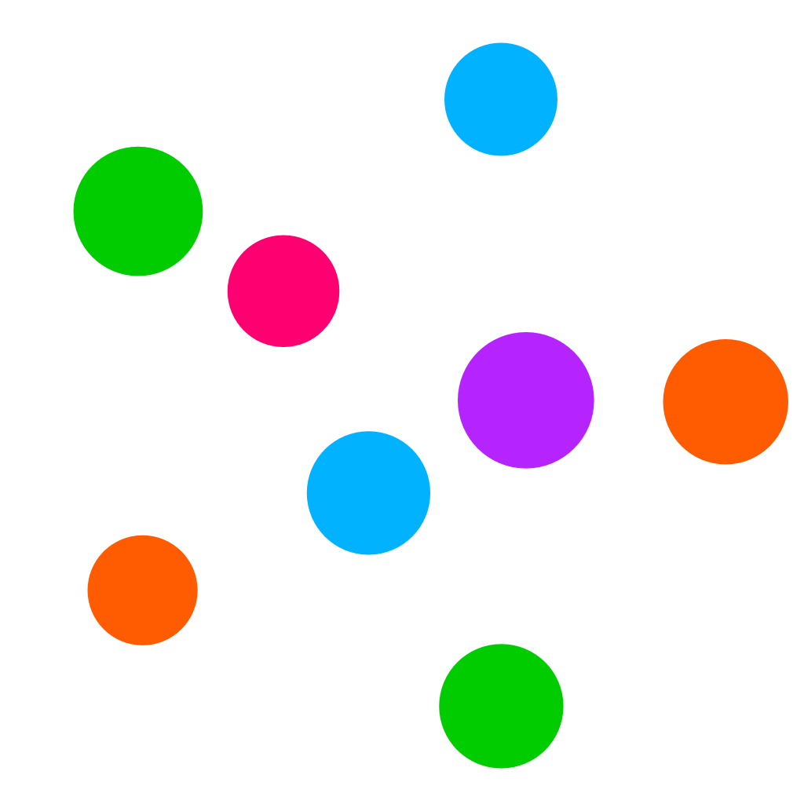

    
    <h1><a href="https://genresin.space">genresin.space</a></h1>

A graph of every music genre on English Wikipedia, inspired by
[8831](https://eightyeightthirty.one/) and [musicmap](https://musicmap.info/).

Uses a Rust data processor to extract music genres from
[a Wikipedia dump](https://dumps.wikimedia.org/enwiki/) to produce data for the frontend website
to use.

The frontend website uses React and [Cosmograph](https://cosmograph.app/)[^1].

[^1]:
    Rokotyan, N., Stukova, O., Kolmakova D. & Ovsyannikov, D. (2022). Cosmograph: GPU-accelerated
    Force Graph Layout and Rendering [Computer software]. https://cosmograph.app/

For more information, see my blog post (TODO).
